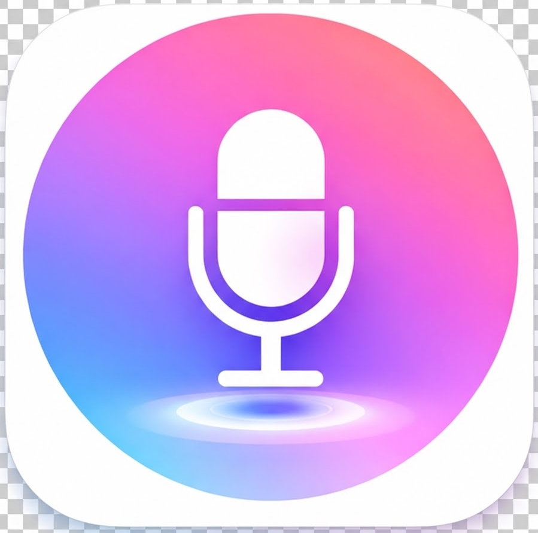
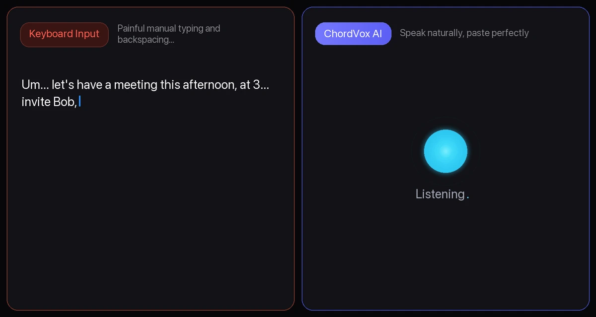

## 🌐 [点击这里切换到：中文版 (Chinese Version)](./README.md)

<p align="center">
  
</p>

<h1 align="center">ChordVox IME</h1>

<h2 align="center">Still fighting with slow typing or messy voice dictation?</h2>
<h3 align="center">"Your mouth is the fastest keyboard."</h3>

<p align="center">
  Completely local voice recognition—dictate instantly even offline.<br>
  Optionally plug in <b>the most powerful AI brains (ChatGPT / Gemini / Claude)</b> to auto-polish and format with a single sentence.
</p>

<p align="center">
  
</p>

<p align="center">
  Don't let your private conversations become free training data for AI models, and don't let your personal data fuel targeted ads.<br>
  <strong>100% Open Source · Truly permanent, offline, and free—your privacy never leaves your device.</strong>
</p>

<p align="center">
  Choose your language:<br/>
  <a href="./README.en.md"></a>
  <a href="./README.md"></a>
</p>

<p align="center">
  <a href="https://github.com/GravityPoet/ChordVox/releases"></a>
</p>

<p align="center">
  <strong>Join the ChordVox community</strong><br>
  Get release updates, ask questions, and share feedback in our Telegram channel:<br>
  <a href="https://t.me/chordvox6">https://t.me/chordvox6</a>
</p>

<p align="center">
  
</p>

---

### Why You Need ChordVox

Typing by hand is a bottleneck—your thoughts flow at **150+ WPM**, but fingers crawl at **40 WPM**.

Standard dictation tools are frustrating: they leave in every filler word, garble punctuation, force you to copy-paste between separate windows, or upload your private voice recordings to cloud servers.

**ChordVox removes every piece of friction:** Press one hotkey, speak naturally, let AI polish your speech into crisp, formatted prose, and watch it paste instantly into whatever app you are using.

> 💡 **Free forever local speech-to-text.** Audio never leaves your machine. Use local AI models or bring your own API keys (BYOK) whenever you want deep refinement.

---

### Before vs. After

| Before ChordVox | With ChordVox |
|---|---|
| Typing speed bottlenecks deep thinking (40 WPM) | Speak naturally at full train-of-thought speed (150+ WPM) |
| Raw dictation dumps filler words: *"Umm, let's meet at 3... no, 4pm"* | AI formats into crisp prose: `[Meeting Notice] Time: 4:00 PM today` |
| Switching to a dictation app, copying text, and pasting back | One shortcut: records, transcribes, refines, and pastes directly at cursor |
| Voice clips and proprietary text uploaded to third-party clouds | 100% offline local transcription (`whisper.cpp`, `Parakeet`, `SenseVoice`) |
| Industry jargon, medical terms, and code acronyms get mangled | Custom dictionary biases the engine toward your domain terms |
| One-size-fits-all model for all dictation tasks | Multi-Shortcut Workflows: instant draft vs. deep reasoning on different keys |

---

### 3 Killer Features

- ⌨️ **Instant Paste at Cursor (Zero Window Switching)**
  - **Result:** Never copy-paste again. Hold your shortcut in VS Code, Slack, Notion, Word, or any browser, speak, and release. ChordVox transcribes, refines, and inserts the result directly where your cursor was blinking.
  - **Under the Hood:** Deep native OS hooks via AppleScript/Swift on macOS, SendKeys/low-level keyboard hooks on Windows, and XTest/ydotool on Linux.

- 🧠 **AI Refinement Pipeline & Executive Assistant**
  - **Result:** Transforms conversational rambles into structured bullet points, executive summaries, or clean code comments. Say *"Hi ChordVox, draft a reply declining this politely..."*, and it switches from dictation to an instruction-following assistant.
  - **Under the Hood:** Connect to OpenAI, Anthropic Claude, Google Gemini, Groq, DeepSeek, or run private local GGUF models via bundled `llama.cpp`.

- 🔒 **100% Private, Free Forever Local STT & BYOK**
  - **Result:** Core transcription runs completely offline on your CPU/GPU. No audio ever touches the network. Bring Your Own Key (BYOK) for cloud AI or use local reasoning for zero-cloud privacy.
  - **Under the Hood:** Built-in high-performance `whisper.cpp`, NVIDIA `Parakeet`, and `SenseVoice` engines with zero Python runtime required.

### 👀 Architecture & Hardcore Specs

```
┌─────────────┐    ┌──────────────────────────┐    ┌─────────────────┐    ┌──────────────┐
│  Hotkey      │───▶│  Audio Capture           │───▶│  STT Engine     │───▶│  AI Refine   │───▶ Paste
│  (Globe/Fn/  │    │  MediaRecorder → IPC     │    │  whisper.cpp    │    │  GPT / Claude│    at
│   Custom)    │    │  → temp .wav file        │    │  Parakeet       │    │  Gemini/Groq │    Cursor
└─────────────┘    └──────────────────────────┘    │  SenseVoice     │    │  Local GGUF  │
                                                    │  Cloud STT      │    └──────────────┘
                                                    └─────────────────┘
```

- **Tech Stack**: Electron 41 · React 19 · TypeScript · Vite · Tailwind CSS v4 · shadcn/ui · better-sqlite3 · whisper.cpp · sherpa-onnx (Parakeet) · llama.cpp · FFmpeg (bundled)
- **Multi-Shortcut Workflows**: Assign independent hotkeys to different workflows with separate transcription and reasoning models.
- **Custom Dictionary**: Add colleague names, internal acronyms, and technical terms to guide both the STT and LLM engines.
- **Model Cache Management**: 1-click cleanup of Whisper/GGUF model caches to reclaim disk space whenever needed.

---

### Who Needs This / Use Cases

- 👤 **Everyday Users & Everyone:** Casual messaging, searching the web, journaling, posting on social media, and capturing quick thoughts—speak naturally and get crisp, polished text without typing.
- 👨‍💻 **Software Engineers:** Write PR descriptions, code comments, architecture RFCs, and commit messages without taking hands off the thinking flow.
- ✍️ **Writers & Researchers:** Capture first-draft brainstorms, blog posts, and scripts at natural speech velocity.
- 👔 **Managers & Executives:** Triage Slack messages, compose detailed email responses, and summarize meeting outcomes in seconds.
- 🔒 **Privacy-Sensitive Teams:** Legal, medical, and financial professionals who require 100% on-device speech processing with zero third-party telemetry.

---

### Download

- [Download ChordVox on GitHub Releases](https://github.com/GravityPoet/ChordVox/releases)
- [Download the latest release](https://github.com/GravityPoet/ChordVox/releases/latest)

Once you open the release page, click the file that matches your system:

- macOS (Apple Silicon): `ChordVox-*-arm64.dmg`
- Windows (x64): `ChordVox-Setup-*.exe`
- Linux (x64): `ChordVox-*-linux-x86_64.AppImage`, `ChordVox-*-linux-amd64.deb`, or `ChordVox-*-linux-x86_64.rpm`

> [!IMPORTANT]
> **Essential for macOS First Launch**: The macOS customer build uses ChordVox's stable self-signed certificate and is not Apple-notarized. Drag `ChordVox.app` into `Applications`, then open it from Applications. On each new Mac, you will normally need to choose **Open Anyway** in **System Settings > Privacy & Security** once. If it is still blocked, go back to the DMG and double-click `Fix & Open.command` on the right — it only removes the quarantine flag from the installed app and then opens ChordVox.

> Free forever local speech-to-text. AI enhancement, file transcription, BYOK, and advanced workflows are available through optional Pro features.

### Quick Links

- 📦 [All Releases](https://github.com/GravityPoet/ChordVox/releases)
- 📖 [Legacy Technical README](docs/README_LEGACY.md)
- 📬 Contact: `moonlitpoet@proton.me`

---

### License & Open Source Commitment

ChordVox Community Edition is open source under the **[AGPL-3.0 License](./LICENSE)**.

- **Open Source Free Use:** Free for individual and enterprise use in accordance with AGPL-3.0 terms.
- **Commercial Dual-License:** For proprietary integration or closed-source redistribution without AGPL-3.0 copyleft obligations, please contact `moonlitpoet@proton.me`.
- **Third-Party Attributions:** See [NOTICE](./NOTICE) and [Open Source Notices](./resources/legal/OPEN_SOURCE_NOTICES.txt).