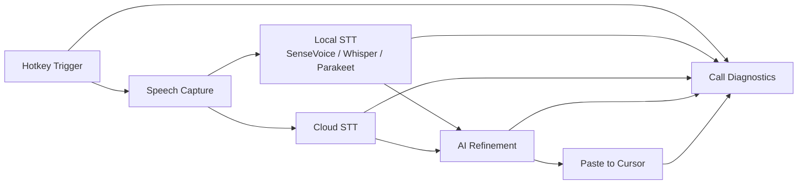

# AriaKey · AI Voice Keyboard / AI 语音输入法

[](https://github.com/GravityPoet/AriaKey/releases)
[](https://github.com/GravityPoet/AriaKey/releases)
[](./LICENSE)

自然开口，剩下的交给 AI。AriaKey 是隐私优先的桌面语音输入法，支持本地转录、AI 润色、光标处自动粘贴。

Speak naturally, let AI do the rest. AriaKey is a privacy-first desktop voice keyboard with local transcription, AI refinement, cursor-level paste.

---

## Quick Links

- Releases: https://github.com/GravityPoet/AriaKey/releases
- Latest: https://github.com/GravityPoet/AriaKey/releases/latest
- Legacy full technical README: [`docs/README_LEGACY.md`](docs/README_LEGACY.md)
- Contact: `moonlitpoet@proton.me`

---

## Global Overview

AriaKey focuses on one workflow:

1. Trigger recording by hotkey.
2. Transcribe speech (local or cloud).
3. Refine text with AI model.
4. Paste result at current cursor.
5. Show diagnostics for each phase (recording/transcription/reasoning/paste).



---

## 中文版

### 1) 产品定位

AriaKey 是面向创作者、办公用户和开发者的桌面级 AI 语音输入法，核心目标是：

- 本地可用：支持离线语音转文字。
- 文本可用：支持 AI 自动润色与修正。
- 工作流可用：在任意输入框直接粘贴结果。
- 交付可用：支持授权码激活，适合商业分发。

### 2) 核心能力

- 本地转录：SenseVoice / Whisper / Parakeet。
- 云端模型：OpenAI / Anthropic / Gemini / Groq / Custom Endpoint。
- 双方案快捷键：可配置不同快捷键绑定不同模型与润色策略。
- 调用诊断：查看每次调用是否成功，失败原因可追踪。
- 设置导入导出：快速迁移客户配置。
- 桌面授权：激活、校验、离线宽限、撤销流程。

### 3) 下载矩阵（当前发布）

当前稳定版：[`v1.5.18`](https://github.com/GravityPoet/AriaKey/releases/tag/v1.5.18)

| 系统 System | 芯片 Chip | 格式 Format | 下载链接 Download link |
| --- | --- | --- | --- |
| Windows | x64 | exe | 暂未上传 |
| Mac | Apple Silicon | dmg | [mac-arm64](https://github.com/GravityPoet/AriaKey/releases/download/v1.5.18/AriaKey-1.5.18-arm64.dmg) |
| Mac | Intel | dmg | 暂未上传 |
| Linux | x64 | deb | 暂未上传 |
| Linux | x64 | AppImage | 暂未上传 |

### 4) macOS 首次安装说明

未公证版本在部分 macOS 会出现“已损坏/无法验证”提示，按以下 3 步处理：

1. 把 `AriaKey.app` 拖到 `Applications`
2. 在 `Applications` 中右键 `AriaKey.app` -> `打开`
3. 如仍被拦截，执行：

```bash
xattr -dr com.apple.quarantine /Applications/AriaKey.app
open /Applications/AriaKey.app
```

### 5) 合规与版权

本项目基于上游 MIT 项目二次开发。

---

## English Version

### 1) Positioning

AriaKey is a desktop AI voice keyboard for creators, operators, and developers. It is built around four outcomes:

- Local-first speech-to-text
- AI text refinement
- Cursor-level paste workflow
- Commercial licensing readiness

### 2) Core Capabilities

- Local transcription: SenseVoice / Whisper / Parakeet
- Cloud model providers: OpenAI / Anthropic / Gemini / Groq / Custom Endpoint
- Dual hotkey profiles with independent model/refinement settings
- Per-run diagnostics (recording/transcription/reasoning/paste)
- Settings import/export for fast migration
- Desktop license activation and validation flow

### 3) Download Matrix (Current Release)

Current stable: [`v1.5.18`](https://github.com/GravityPoet/AriaKey/releases/tag/v1.5.18)

| System | Chip | Format | Download link |
| --- | --- | --- | --- |
| Windows | x64 | exe | Not uploaded yet |
| macOS | Apple Silicon | dmg | [mac-arm64](https://github.com/GravityPoet/AriaKey/releases/download/v1.5.18/AriaKey-1.5.18-arm64.dmg) |
| macOS | Intel | dmg | Not uploaded yet |
| Linux | x64 | deb | Not uploaded yet |
| Linux | x64 | AppImage | Not uploaded yet |

### 4) macOS First-Launch Notice

For unsigned/unnotarized builds, Gatekeeper may block first launch. If that happens:

1. Move `AriaKey.app` to `Applications`
2. Right-click `AriaKey.app` -> `Open`
3. If still blocked:

```bash
xattr -dr com.apple.quarantine /Applications/AriaKey.app
open /Applications/AriaKey.app
```

### 5) Legal & Compliance

This project is derived from an MIT-licensed upstream.

---

## Repository Navigation

- Documentation: [`docs/`](docs)
- Legal compliance: [`docs/legal/`](docs/legal)
- Marketing copy: [`docs/marketing/`](docs/marketing)
- Legacy deep technical guide: [`docs/README_LEGACY.md`](docs/README_LEGACY.md)
