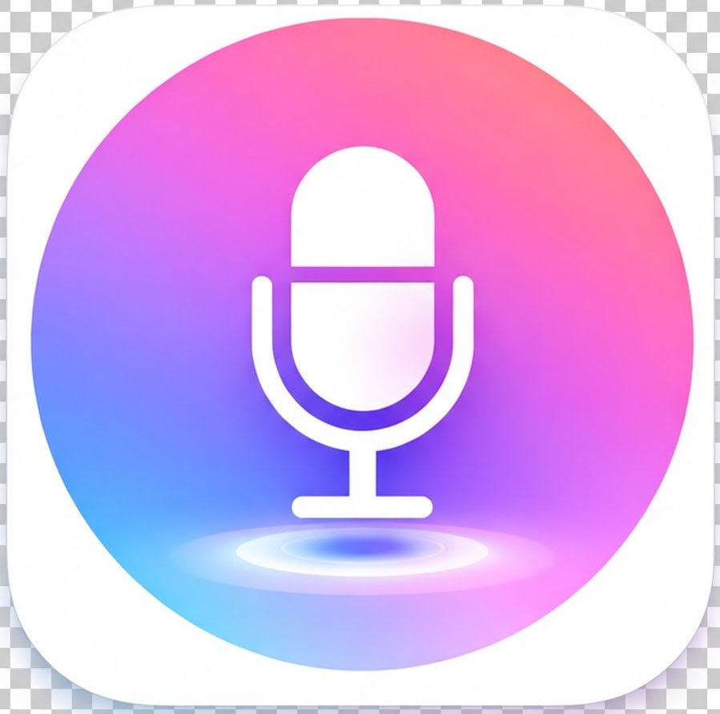

<p align="center">
  
</p>


<h1 align="center">ChordVox IME</h1>

<p align="center">
  <strong>Still typing by hand or fixing speech recognition errors?</strong>
</p>

<h3 align="center">Your voice is the fastest keyboard.</h3>

<p align="center">
  Fully local AI voice input — speak and get polished text in seconds, auto-pasted in one shot.<br/>
  Your privacy stays in your hands. No sign-up, works out of the box.
</p>

<p align="center">
  <a href="https://github.com/GravityPoet/ChordVox/releases/latest"></a>
  <a href="https://github.com/GravityPoet/ChordVox/releases"></a>
  <a href="./LICENSE"></a>
  <a href="#"></a>
</p>

<p align="center">
  <strong>English</strong> | <a href="./README.zh.md">中文</a>
</p>

---

### Pain Points Solved

| 😩 Pain Point | ✅ ChordVox Solution |
|---|---|
| Typing is slow — thoughts race ahead of your fingers | Speak naturally → polished text in under 2 seconds |
| Cloud voice tools send recordings to unknown servers | Local STT — audio never leaves your machine |
| Raw transcription is messy, punctuation is chaotic | AI polish auto-fixes grammar, punctuation & formatting |
| Constant window-switching between dictation app and editor | Paste directly at cursor, zero interruption |
| Specialized terms (medical / legal / code) get misrecognized | Custom dictionary guides the model toward your domain vocabulary |
| Different tasks need different AI quality levels | Dual hotkey profiles: fast draft (Groq) / polished output (GPT-5 / Claude) |

---

### Key Features

- 🔒 **Privacy-First, Runs Locally** — Built-in STT engines (whisper.cpp · NVIDIA Parakeet · SenseVoice). Audio never leaves your machine. No Python needed, native binaries work out of the box.

- 🧠 **AI Polish Pipeline** — Raw speech → polished text. Connect to OpenAI / Anthropic / Gemini / Groq / any endpoint, or run local GGUF models via bundled llama.cpp. Auto-fixes grammar, context, and formatting.

- ⌨️ **Paste at Cursor** — One hotkey: record → transcribe → polish → paste at your active cursor. Native Globe/Fn key support on macOS, true Push-to-Talk via keyboard hooks on all platforms.

- 🎯 **Assistant Name & Command Mode** — Give your AI assistant a custom name. Say "Hi ChordVox, draft a reply to that email…" and it instantly switches from typing mode to intelligent assistant mode.

- 📖 **Custom Dictionary** — Add your own names, jargon, and abbreviations. Dramatically improve accuracy for medical, legal, coding, and other specialized domains.

- 🌍 **58 Languages · 10 UI Locales** — Auto-detect or manually lock language. Fully localized UI: EN / ZH-CN / ZH-TW / JA / DE / FR / ES / PT / IT / RU.

- 🔄 **Dual-Profile Hotkeys** — Two independent hotkeys bound to different STT engines, AI models, and polish strategies. Switch workflows in a single keystroke.

- 🧹 **Storage Management** — One-click cleanup of downloaded Whisper / GGUF model caches to free up disk space.

---

### Download & Install

👉 **[Go to GitHub Releases to download the latest version](https://github.com/GravityPoet/ChordVox/releases/latest)**

> [!IMPORTANT]
> **macOS Users: Required First-Launch Unlock**
> 
> Because this is an open-source app and not downloaded from the Mac App Store, macOS may block it on its first run. After installing the app for the first time, please open your Terminal and run the following command to remove this restriction (this only needs to be done once):
> 
> ```
> xattr -dr com.apple.quarantine /Applications/ChordVox.app
> open /Applications/ChordVox.app
> ```
> 
> **The code for this software is entirely transparent and open source. You can feel safe running it.**

---

### How It Works

```
┌─────────────┐    ┌──────────────────────────┐    ┌─────────────────┐    ┌──────────────┐
│  Hotkey      │───▶│  Audio Capture           │───▶│  STT Engine     │───▶│  AI Polish   │───▶ Paste
│  (Globe/Fn/  │    │  MediaRecorder → IPC     │    │  whisper.cpp    │    │  GPT / Claude│    at
│   Custom)    │    │  → temp .wav file        │    │  Parakeet       │    │  Gemini/Groq │    Cursor
└─────────────┘    └──────────────────────────┘    │  SenseVoice     │    │  Local GGUF  │
                                                    │  Cloud STT      │    └──────────────┘
                                                    └─────────────────┘
```

**Tech Stack**: Electron 36 · React 19 · TypeScript · Vite · Tailwind CSS v4 · shadcn/ui · better-sqlite3 · whisper.cpp · sherpa-onnx (Parakeet) · llama.cpp · FFmpeg (bundled)

---


---

### Quick Links

- 🌐 [Website chordvox.com](https://chordvox.com)
- 📦 [All Releases](https://github.com/GravityPoet/ChordVox/releases)
- 📖 [Legacy Technical README](docs/README_LEGACY.md)
- 📬 Contact: `moonlitpoet@proton.me`

---

### License

MIT License. See [LICENSE](./LICENSE) and [NOTICE](./NOTICE).
